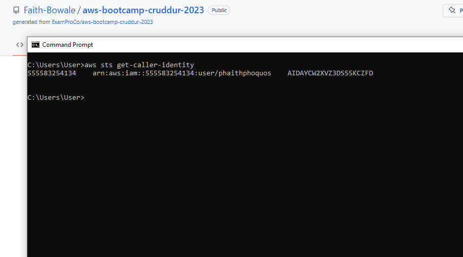
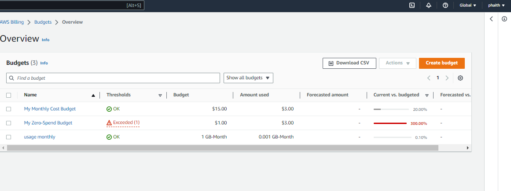
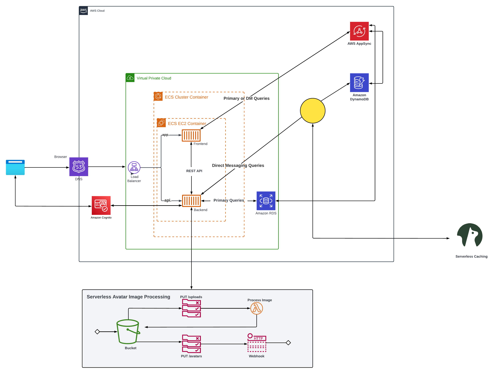
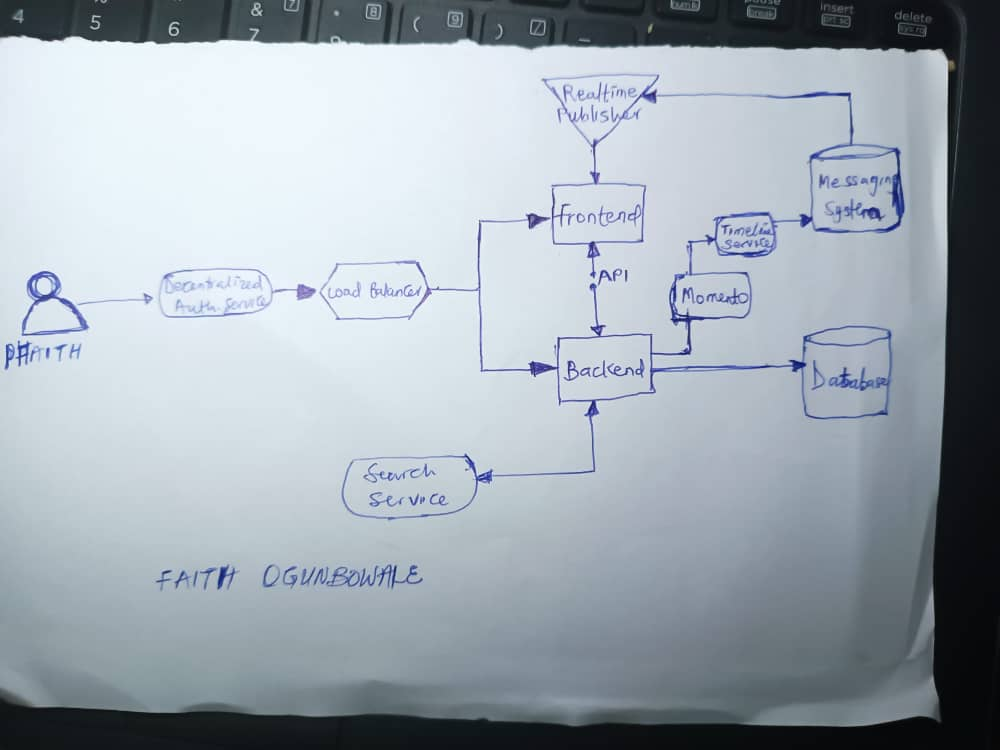
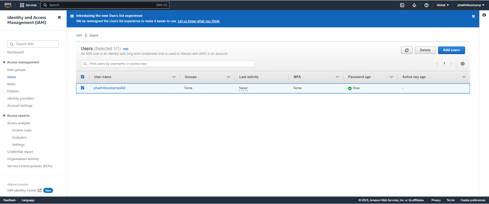

# Week 0 — Billing and Architecture

## Journaling Required Homework/Tasks

### Install and Verify AWS CLI 

I decided to my pc local enviroment.
i went ahead to try it out on aws cloud shell

To prove that I am able to use the AWS CLI.
The following instructions were what i used followed to carry out the given task to
configure it on my local machine on windows.

I did the following steps to install AWS CLI.

I installed the AWS CLI for Windows 10 via command in **Command Prompt**:

I followed the instructions on the [AWS CLI Install Documentation Page](https://docs.aws.amazon.com/cli/latest/userguide/getting-started-install.html)


```
 msiexec.exe /i https://awscli.amazonaws.com/AWSCLIV2.msi
```

I ran the command and it was successful.
Here is a proof.


I also attempted to do the CLI on aws cloudshell.
Here is a proof of the CLI working environment.


```

### Create a Budget

I created a My Monthly Cost Budget,My Zero-Spend Budget and Usage Monthly Budget of $15, $1 and 1 GB-Month usage Respectively.
I intend to review my Spends and will be making some adjustments on it.
It is quite interesting that we can download,create and delete budget.
This is a great feauture!

 

### Recreate Logical Architectural Deisgn

This was quite an eventful and interesting task.I was exposed to learn how to use the application,understand its purpose and learn about icons for representation.
I Locked my diagram and i granted access for view and comment only.



[Lucid Charts Share Link](https://lucid.app/lucidchart/7e2acd25-21c7-4da7-a617-5b9f29b926c9/edit?viewport_loc=-1191%2C-516%2C3570%2C1461%2C0_0&invitationId=inv_97c5ce57-580f-4a62-aaec-3a9e6423f05a)

## Napkin Design ##

I used a pen to replicate a sample design that was done during the life stream.



## IAM User ##
I created an IAM user from my root account with the purpose of strictly following AWS security best Practice.



I assigned the IAM the role of an administrator,secured with with MFA according to AWS security best practices.


